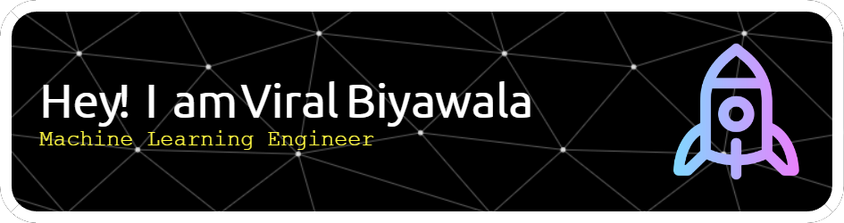

Welcome to my corner of the digital universe! I’m an enthusiastic and dedicated Computer Science student exploring the ever-evolving world of **Artificial Intelligence**, **Machine Learning**, and **Data Science**. Based in Surat, Gujarat, India, I thrive on leveraging technology to solve complex problems and drive innovation.

---

### 🌟 **A Bit About Me**

I’ve always been passionate about unraveling the mysteries of technology and pushing the boundaries of what’s possible. My journey so far has been a hands-on adventure, from developing AI solutions to building predictive models and web applications. I’m a firm believer in continuous learning and applying that knowledge to make a meaningful impact.

Beyond coding and data, here are a few other things that excite me:

- **Coding:** I love experimenting with new algorithms and frameworks—often losing track of time while solving intricate problems.
- **Data Analysis:** The excitement of discovering actionable insights hidden in data is unmatched!
- **Web Development:** Crafting applications that blend functionality with user-friendly design is always rewarding.
- **Hobbies:** When I’m not coding, you’ll find me playing chess, trying out new recipes in the kitchen, or hiking nature trails to recharge my creative energy.

---

### 🎓 **My Academic Journey**

I’m currently pursuing a **Bachelor of Technology** in **Computer Science and Engineering** at the **Indian Institute of Information Technology, Surat**, where I’ve maintained a CGPA of 9.33/10.0. Education has been a cornerstone of my growth, but I’ve also learned a lot outside the classroom through internships, personal projects, and competitions.

---

### 🏆 **Selected Experiences**

- **AI/ML Intern at Build Macro (Canberra, Australia):**  
  Here, I engineered AI solutions using **Tesseract-OCR** and **YOLOv9** to automate the detection of architectural objects, reducing manual processing time by 91%. I deployed the system on **Google Cloud Platform**, achieving an impressive 85% accuracy in detecting various architectural elements.

---

### 🛠️ **Skills & Technologies**

I love working with diverse technologies to solve real-world problems. Here’s a glimpse of my tech toolkit:

- **Programming Languages:** Python, SQL, C++, YAML, JavaScript
- **Frameworks & Libraries:** Pandas, NumPy, Scikit-Learn, PyTorch, Flask, Django, OpenCV
- **Cloud & Database:** Google Cloud Platform (GCP), PostgreSQL, Roboflow, RESTful APIs

---

### 🌍 **Let’s Connect!**

I’m always excited to meet new people, collaborate on projects, or simply chat about the latest trends in AI and machine learning. If you have an idea to discuss or want to connect for potential opportunities, don’t hesitate to reach out!

- 📧 **Email me:** viralbiyawala@gmail.com  
- 🔗 **LinkedIn:** [Viral Biyawala LinkedIn](https://www.linkedin.com/in/viralbiyawala)  
- 🌐 **Portfolio:** [Check out my Portfolio](https://viralbiyawala.pythonanywhere.com)

Thanks for stopping by—looking forward to connecting with you! 🚀

# 🌐 Socials:

# 💻 Tech Stack:

# 📊 GitHub Stats:

    
    
  

<!-- Proudly created with GPRM ( https://gprm.itsvg.in ) -->
